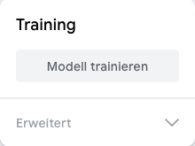

## Trainieren und testen

Trainiere ein Modell, um zu erkennen, was du in der Hand hast.

<html>
  

    <iframe style="position: absolute; top: 0; left: 0; right: 0; width: 100%; height: 100%; border: none;" src="https://www.youtube.com/embed/9Vsq1XfcXtY?rel=0&cc_load_policy=1" allowfullscreen allow="accelerometer; autoplay; clipboard-write; encrypted-media; gyroscope; picture-in-picture; web-share"></iframe>
  

</html>

### Modell trainieren

\--- task ---

Klicke auf **Modell trainieren**.

**Hinweis:** Hab etwas Geduld! Der Vorgang kann 10 bis 20 Sekunden dauern.

\--- /task ---

### Modell testen

\--- task ---

Halte deinen **grünen** Apfel vor deine Webcam.

Das Modell sollte die Vorhersage mit einer **hohen Sicherheit** treffen, dass es sich um einen **Apfel** handelt.

\--- /task ---

\--- task ---

Halte deine **rote** Tomate vor deine Webcam.

Das Modell sollte die Vorhersage mit einer **hohen Sicherheit** treffen, dass es sich um eine **Tomate** handelt.

\--- /task ---
