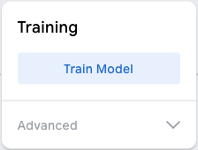

## Improve the model

<html>
  

    <iframe style="position: absolute; top: 0; left: 0; right: 0; width: 100%; height: 100%; border: none;" src="https://www.youtube.com/embed/XXXXXXXXXXX?rel=0&cc_load_policy=1" allowfullscreen allow="accelerometer; autoplay; clipboard-write; encrypted-media; gyroscope; picture-in-picture; web-share"></iframe>
  

</html>

--- collapse ---
---
title: I cannot access YouTube
---

<video width="640" height="360" controls>
  <source src="images/XXXXXXXXXXX.mp4" type="video/mp4">
Your browser does not support the video tag.
</video>

--- /collapse ---

The training data is biased, as it is only trained on green apples.

To reduce the bias, you need to add extra examples of apples to the 'Apple' class.

--- task ---

Download a folder of [more images of apples](https://drive.google.com/drive/folders/1OIuoG7go72c7QririIpykJ4tW-arrtfA){:target="_blank"}.

--- /task ---

--- task ---

Unzip the new images.

--- /task ---

--- task ---

In the 'Apple' class, add some samples of images from one of the folders you have just downloaded.

Choose images that look most like your **red** apple.

**Tip**: You can also use your webcam to take images of your red apple.

**Tip**: You only need to add a few extra samples.

--- /task ---

### Train the model again

--- task ---

Click **Train Model**.

--- /task ---

When the model is trained, the preview panel will open.

--- task ---

Test the model again by holding up your **red** apple to your webcam.

The model should make a ***more* confident** prediction that it is an *apple*.

--- /task ---

--- collapse ---
---
title: Note to educators
---

You may choose to introduce learners to the concept of the ethical bias that can result from the use of biased training data.

--- /collapse ---
