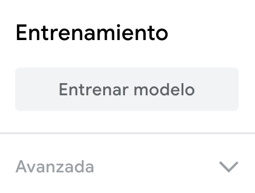

## Mejora el modelo

<html>
  

    <iframe style="position: absolute; top: 0; left: 0; right: 0; width: 100%; height: 100%; border: none;" src="https://www.youtube.com/embed/66bpBQrxSp4?rel=0&cc_load_policy=1" allowfullscreen allow="accelerometer; autoplay; clipboard-write; encrypted-media; gyroscope; picture-in-picture; web-share"></iframe>
  

</html>

La data de entrenamiento está sesgada, dado que solo incluye manzanas verdes.

Para reducir el sesgo, debes agregar ejemplos adicionales de manzanas a la clase 'Manzana'.

\--- task ---

Descarga una [carpeta de más imágenes de manzanas](https://drive.google.com/drive/folders/1OIuoG7go72c7QririIpykJ4tW-arrtfA){:target="_blank"}.

\--- /task ---

\--- task ---

Descomprime la nueva carpeta.

\--- /task ---

\--- task ---

En la clase 'Manzana', agrega algunas imágenes de muestra de una de las carpetas que acabas de descargar.

Escoge imágenes que se vean lo más semejantes a tu manzana **roja**.

**Consejo:** También puedes utilizar tu cámara web para tomar imágenes de tu manzana roja.

**Consejo:** Solo necesitas agregar unas cuantas imágenes adicionales a tu clase 'Manzana'.

\--- /task ---

### Entrena el modelo una vez más

\--- task ---

Haz clic en **Entrenar Modelo**.

\--- /task ---

Cuando el modelo haya sido entrenado, el panel de previsualización se abrirá.

\--- task ---

Sostén tu manzana **roja** en frente de la cámara web para probar el modelo nuevamente.

El modelo debería producir una predicción con un **puntaje de probabilidad alta** de que es una **manzana**.

\--- /task ---

\--- task ---

Sostén tu tomate en frente de la cámara web.

El modlo podría producir una predicción con un **puntaje de probabilidad menor** de que es un **tomate**.

Esto sucede porque has agregado data de entrenamiento a la categoría 'Manzana' de imágenes que se parecen más a tomates.

\--- /task ---

## --- collapse ---

## título: Nota a los educadores

Puede elegir presentarle a los alumnos el concepto del sesgo ético que puede resultar del uso de data de entrenamiento sesgada.

\--- /collapse ---
