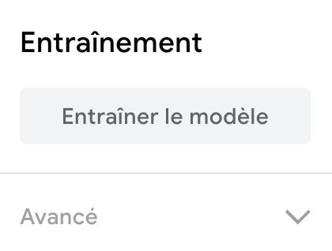

## Améliorer le modèle

<html>
  

    <iframe style="position: absolute; top: 0; left: 0; right: 0; width: 100%; height: 100%; border: none;" src="https://www.youtube.com/embed/66bpBQrxSp4?rel=0&cc_load_policy=1" allowfullscreen allow="accelerometer; autoplay; clipboard-write; encrypted-media; gyroscope; picture-in-picture; web-share"></iframe>
  

</html>

Les données d'apprentissage sont biaisées, car elles ne comprennent que des pommes vertes.

Pour réduire le biais, il faut ajouter des exemples supplémentaires de pommes à la catégorie « Pomme ».

\--- task ---

Télécharge un [dossier contenant plus d'images de pommes](https://drive.google.com/drive/folders/1OIuoG7go72c7QririIpykJ4tW-arrtfA){:target="_blank"}.

\--- /task ---

\--- task ---

Décompresse le nouveau dossier.

\--- /task ---

\--- task ---

Dans la classe « Pomme », ajoute des échantillons d'images provenant d'un des dossiers que tu viens de télécharger.

Choisis les images qui ressemblent le plus à ta pomme **rouge**.

**Astuce :** tu peux aussi utiliser ta webcam pour prendre des images de ta pomme rouge.

**Astuce :** il te suffit d'ajouter quelques échantillons supplémentaires à ta classe « Pomme ».

\--- /task ---

### Entraîner à nouveau le modèle

\--- task ---

Clique sur **Modèle d'entraînement**.

\--- /task ---

Lorsque le modèle est entraîné, le panneau d'aperçu s'ouvre.

\--- task ---

Tiens ta pomme **rouge** devant ta webcam pour tester à nouveau le modèle.

Le modèle devrait produire une prédiction avec un **score de confiance plus élevé** qu'il s'agit d'une **pomme**.

\--- /task ---

\--- task ---

Tiens ta tomate devant ta webcam.

Le modèle pourrait produire une prédiction avec un **score de confiance inférieur** qu'il s'agit d'une **tomate**.

C'est parce que tu as ajouté des données d'entraînement à la classe « Pomme » des images qui ressemblent plutôt à des tomates.

\--- /task ---

## --- collapse ---

## title: Note aux éducateurs

Vous pouvez choisir d'introduire les apprenants au concept de biais éthique qui peut résulter de l'utilisation de données de formation biaisées.

\--- /collapse ---
