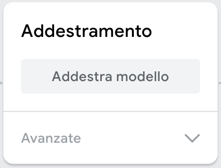

## Addestra e testa

Addestra un modello per rilevare l’oggetto che stai tenendo in mano.

<html>
  

    <iframe style="position: absolute; top: 0; left: 0; right: 0; width: 100%; height: 100%; border: none;" src="https://www.youtube.com/embed/9Vsq1XfcXtY?rel=0&cc_load_policy=1" allowfullscreen allow="accelerometer; autoplay; clipboard-write; encrypted-media; gyroscope; picture-in-picture; web-share"></iframe>
  

</html>

### Addestra il modello

Fai clic su **Train Model**.

**Nota:** Abbi pazienza! Il processo può richiedere dai 10 ai 20 secondi.

### Testa il modello

Tieni la tua mela **verde** di fronte alla webcam.

Il modello dovrebbe produrre una previsione con un **punteggio di confidenza elevato** che indichi che si tratti di una **mela**.

Tieni il tuo pomodoro **rosso** davanti alla webcam.

Il modello dovrebbe produrre una previsione con un **punteggio di confidenza elevato** che indichi che si tratti di un **pomodoro**.

