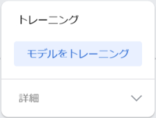

## トレーニングとテスト

何をかざしているかを検出するためにモデルをトレーニングします。

<html>
  

    <iframe style="position: absolute; top: 0; left: 0; right: 0; width: 100%; height: 100%; border: none;" src="https://www.youtube.com/embed/9Vsq1XfcXtY?rel=0&cc_load_policy=1" allowfullscreen allow="accelerometer; autoplay; clipboard-write; encrypted-media; gyroscope; picture-in-picture; web-share"></iframe>
  

</html>

### モデルをトレーニングする

\--- task ---

**モデルをトレーニング**をクリックします。

**注：** しばらくお待ちください！ 完了まで10秒から20秒ほどかかる場合があります。

\--- /task ---

### モデルをトレーニングする

\--- task ---

緑色のリンゴをウェブカメラに向けてください。

モデルは**リンゴ**であることを**高い確信度**で予測するはずです。

\--- /task ---

\--- task ---

**赤い**トマトをウェブカメラに向けてください。

モデルは**トマト**であることを\*\*高い確信度\*で予測するはずです。

\--- /task ---
