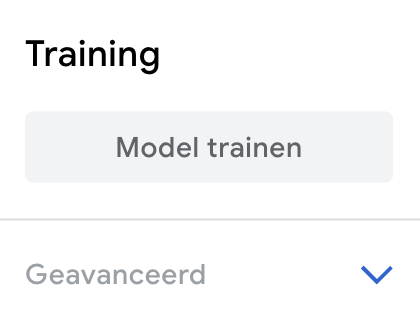

## Trainen en testen

Train een model om te detecteren wat je vasthoudt.

<html>
  

    <iframe style="position: absolute; top: 0; left: 0; right: 0; width: 100%; height: 100%; border: none;" src="https://www.youtube.com/embed/9Vsq1XfcXtY?rel=0&cc_load_policy=1" allowfullscreen allow="accelerometer; autoplay; clipboard-write; encrypted-media; gyroscope; picture-in-picture; web-share"></iframe>
  

</html>

### Train het model

\--- task ---

Klik op **Model trainen**.

**Let op:** Heb geduld! Het kan 10 tot 20 seconden duren om te voltooien.

\--- /task ---

### Test het model

\--- task ---

Houd je **groene** appel voor je webcam.

Het model moet een voorspelling met een **hoge betrouwbaarheidsscore** produceren dat het een **appel** is.

\--- /task ---

\--- task ---

Houd je **rode** tomaat voor je webcam.

Het model moet een voorspelling met een **hoge betrouwbaarheidsscore** produceren dat het een **tomaat** is.

\--- /task ---
