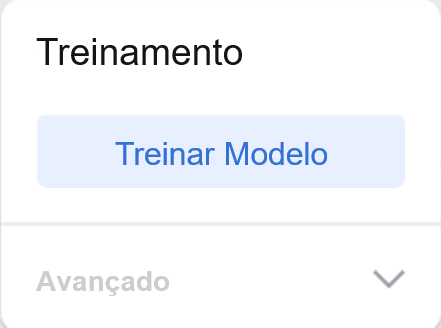

## Melhore o modelo

<html>
  

    <iframe style="position: absolute; top: 0; left: 0; right: 0; width: 100%; height: 100%; border: none;" src="https://www.youtube.com/embed/66bpBQrxSp4?rel=0&cc_load_policy=1" allowfullscreen allow="accelerometer; autoplay; clipboard-write; encrypted-media; gyroscope; picture-in-picture; web-share"></iframe>
  

</html>

Os dados de formação são tendenciosos, visto que incluem apenas maçãs verdes.

Para reduzir o viés, você precisa adicionar exemplos extras de maçãs à classe 'Maçã'.

\--- task ---

Baixe uma [pasta com mais imagens de maçãs](https://drive.google.com/drive/folders/1OIuoG7go72c7QririIpykJ4tW-arrtfA){:target="_blank"}.

\--- /task ---

\--- task ---

Descompacte a nova pasta.

\--- /task ---

\--- task ---

Na classe 'Maçã', adicione alguns exemplos de imagens de uma das pastas que você acabou de baixar.

Escolha imagens que mais se pareçam com sua maçã **vermelha**.

**Dica:** Você também pode usar sua câmera para tirar fotos da sua maçã vermelha.

**Dica:** você só precisa adicionar algumas amostras extras à sua classe 'Maçã'.

\--- /task ---

### Treine o modelo novamente

\--- task ---

Clique em **Treinar Modelo**.

\--- /task ---

Quando o modelo é treinado, o painel de pré-visualização será aberto.

\--- task ---

Segure sua maçã **vermelha** em frente à sua câmera para testar o modelo novamente.

O modelo deve produzir uma previsão com uma **alta pontuação de confiança** de que é uma **maçã**.

\--- /task ---

\--- task ---

Segure um tomate em frente à sua câmera.

O modelo deve produzir uma previsão com um **ponto de confiança menor** que se trata de um **tomate**.

Isso ocorre porque você adicionou dados de treinamento à classe de imagens "Maçã" que se parecem mais com tomates.

\--- /task ---

## --- collapse ---

## título: Nota para educadores

Você pode optar por apresentar aos alunos o conceito de viés ético que pode resultar do uso de dados de treinamento tendenciosos.

\--- /collapse ---
