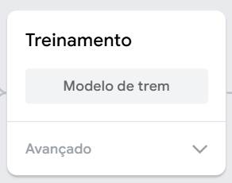

## Melhorar o modelo

<html>
  

    <iframe style="position: absolute; top: 0; left: 0; right: 0; width: 100%; height: 100%; border: none;" src="https://www.youtube.com/embed/66bpBQrxSp4?rel=0&cc_load_policy=1" allowfullscreen allow="accelerometer; autoplay; clipboard-write; encrypted-media; gyroscope; picture-in-picture; web-share"></iframe>
  

</html>

Os dados de treino são enviesados, pois incluem apenas maçãs verdes.

Para reduzir o enviesamento, precisas de adicionar exemplos extra de maçãs para a classe 'Maçã'.

Descarrega a [pasta com mais imagens de maçãs](https://drive.google.com/drive/folders/1OIuoG7go72c7QririIpykJ4tW-arrtfA){:target="_blank"}.

Descompacta a pasta.

Na classe 'Maçã', adiciona algumas imagens de exemplo de uma das pastas que acabaste de descarregar.

Escolhe as imagens que sejam mais parecidas com a tua maçã **vermelha**.

**Dica:** Podes também usar a tua webcam para tirar fotos da tua maçã vermelha.

**Dica:** Só precisas de adicionar algumas imagens extra para a tua classe 'Maçãs'.

### Treina o modelo outra vez

Clica em **Modelo preparado**.

Quando o modelo estiver treinado, o painel de pré-visualização vai abrir.

Segura a tua maçã **vermelha** à frente da tua webcam para testar o modelo.

O modelo deve produzir uma predição com uma **alta pontuação de confiança** de que é uma **Maçã**.

Segura o teu tomate à frente da tua webcam.

O modelo pode produzir uma predição com uma **baixa pontuação de confiança** de que é um **tomate**.

Isto porque adicionaste mais dados de treino à classe 'Maçãs' que se parecem com tomates.

---

## title: Note to educators

Podes optar por introduzir aos alunos o conceito do enviesamento ético que resulta do uso de dados de treino enviesados.

