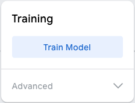

## Eğitim ve test

Elinizde tuttuğunuz şeyi algılayacak bir model eğitin.

<html>
  

    <iframe style="position: absolute; top: 0; left: 0; right: 0; width: 100%; height: 100%; border: none;" src="https://www.youtube.com/embed/9Vsq1XfcXtY?rel=0&cc_load_policy=1" allowfullscreen allow="accelerometer; autoplay; clipboard-write; encrypted-media; gyroscope; picture-in-picture; web-share"></iframe>
  

</html>

### Modelin eğitilmesi

\--- task ---

**Modeli eğitin**e tıklayın.

**Not:** Sabırlı olun! Tamamlanması 10 ila 20 saniye sürebilir.

\--- /task ---

### Modeli test etme

\--- task ---

Yeşil elmanızı web kameranıza doğru tutun.

Model, bunun bir **elma** olduğuna dair **yüksek güven skoru** ile bir tahmin üretmelidir.

\--- /task ---

\--- task ---

**Kırmızı** domatesinizi web kameranıza doğru tutun.

Model, bunun bir **domates** olduğuna dair **yüksek güven skoru** ile bir tahmin üretmelidir.

\--- /task ---
